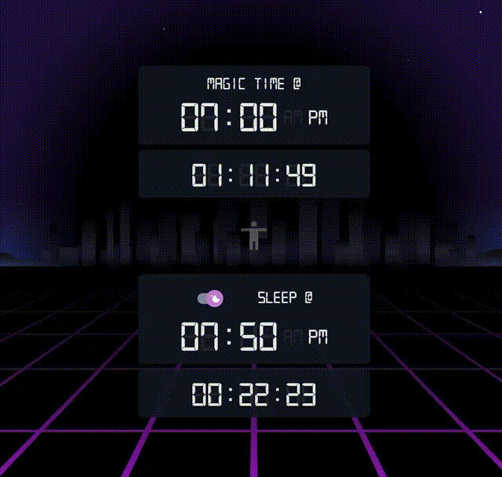
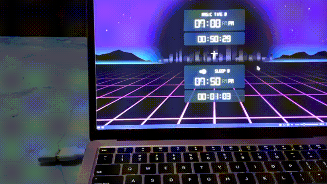

DEMO: [https://nomastickles.github.io/magic-time-tracker/](https://nomastickles.github.io/magic-time-tracker/)

### What does this do

This thing tracks time (eating and sleeping) using a python + react app intended for a raspberry pi on your local network. It's not perfect but it's fun.

You can also set a flag via the UI that other services on your network can look for (like an USB LCD)

### How to run this

```sh

# 1. clone the repo in your pi
# 2. install the deps

pip install python-dotenv marshmallow
pip install --upgrade numpy
pip install --upgrade Flask

# 3. fill out ./backend/.env file
cp ./backend/.env-sample ./backend/.env

# 4. chmod a+x ./start.sh && ./start.sh

```

### ./backend/.env

APP_SECRET = simple not very secure way to gate all flask routes

example of resulting url:
http://192.168.50.123:8765/?key=coolhat

### Get csv of your data

Make a csv of activity via:

```sh
ls -rt1 ./python/data | grep @ > output.csv && sed -i 's/@/,/g; s/\_/,/g' output.csv && cat output.csv
```

### blink1_poll_flag_help.sh

Using fun usb blink1 mk3, run this on your laptop then click the person in the middle of the UI


